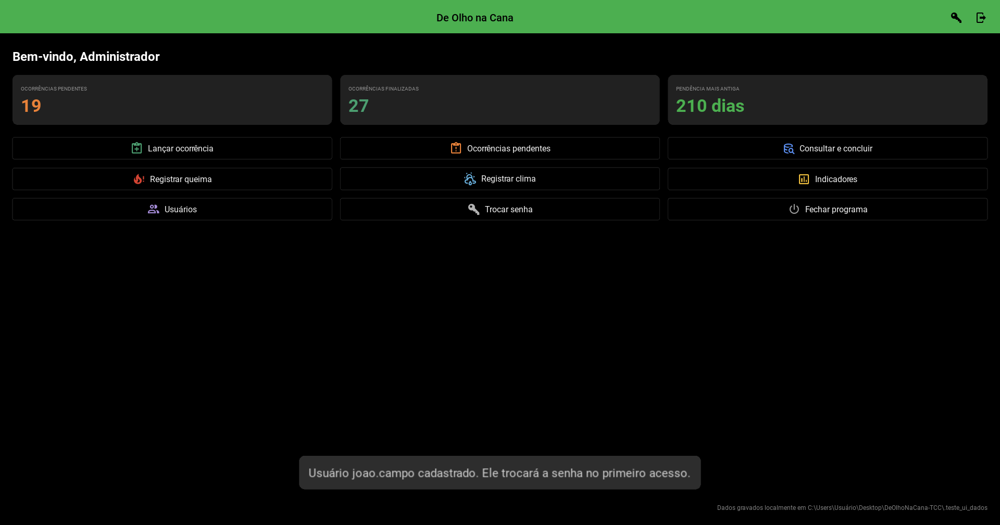
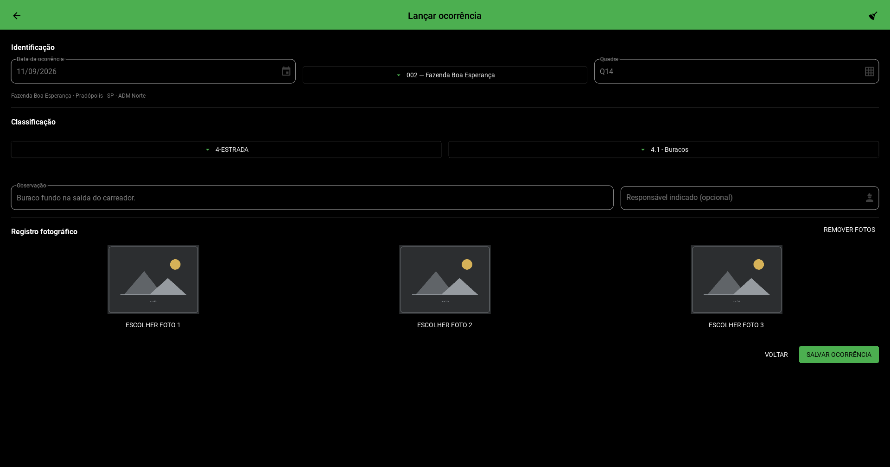
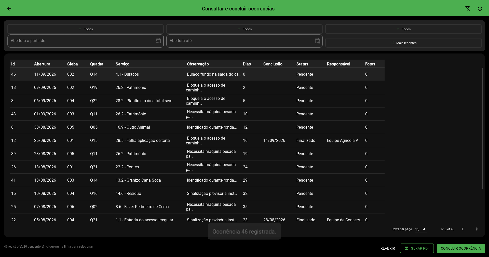
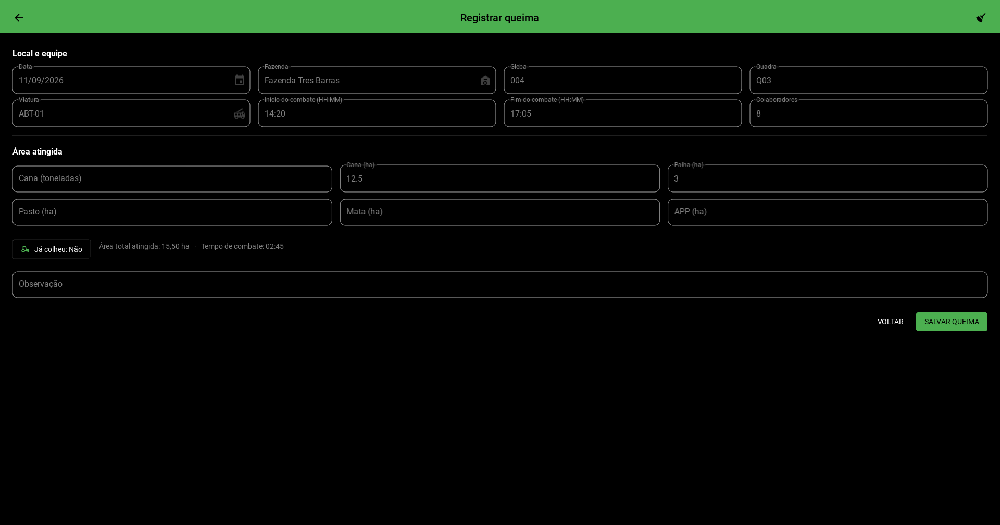
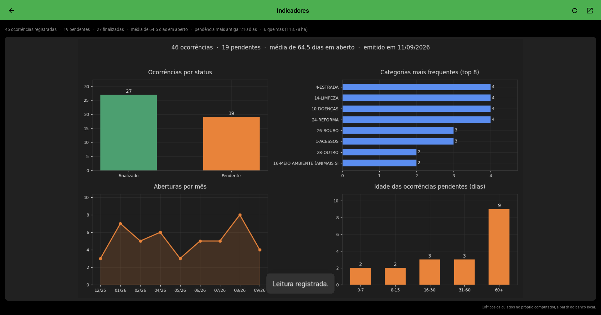

# De Olho na Cana

Sistema desktop para registro e acompanhamento de ocorrências em lavoura canavieira:
apontamentos de campo, boletins de combate a incêndio e leituras meteorológicas, com
consulta filtrada, relatório em PDF e painel de indicadores.

**Funciona em qualquer computador com Python, sem rede e sem internet.** O banco é um
arquivo SQLite na própria máquina, as fotos são copiadas para uma pasta local e os
gráficos e relatórios são gerados no próprio computador.



---

## Sumário

- [Como executar](#como-executar)
- [Primeiro acesso](#primeiro-acesso)
- [Funcionalidades](#funcionalidades)
- [Onde ficam os dados](#onde-ficam-os-dados)
- [Arquitetura](#arquitetura)
- [Testes](#testes)
- [Gerar o executável](#gerar-o-executável)
- [O que mudou em relação à versão anterior](#o-que-mudou-em-relação-à-versão-anterior)

---

## Como executar

Requer **Python 3.10 ou superior** (desenvolvido e testado no 3.12).

```bash
git clone https://github.com/spolao/DeOlhoNaCana.git
cd DeOlhoNaCana
python -m venv .venv
```

Ative o ambiente virtual:

```bash
.venv\Scripts\activate
```

Instale as dependências e rode:

```bash
pip install -r requirements.txt
python executar.py
```

Não é preciso criar banco nem rodar script de carga: a primeira execução monta o banco,
semeia o catálogo de serviços, desenha as imagens da interface e cria a conta inicial.

As imagens não são versionadas — são geradas por código. Para regerá-las a qualquer
momento:

```bash
python ferramentas/gerar_recursos.py
```

Para popular o sistema com dados de demonstração — útil para ver os indicadores e o
relatório funcionando:

```bash
python ferramentas/popular_demo.py
```

## Primeiro acesso

| Usuário | Senha |
|---|---|
| `admin` | `admin` |

O sistema **exige a troca da senha no primeiro login** e recusa senhas óbvias. Depois
disso, o administrador cadastra os demais usuários pela tela **Usuários**, cada um com
uma senha provisória que também terá de ser trocada no primeiro acesso.

## Funcionalidades

### Lançar ocorrência

Data, gleba, quadra, categoria, serviço, observação e até três fotos. A fazenda, o
município e o administrador não são digitados — vêm do cadastro da gleba, o que impede
a mesma gleba aparecer com três grafias diferentes de fazenda.



### Consultar e concluir

Filtros por categoria, serviço, status, período e ordenação. Clicando numa linha é
possível **concluir** a ocorrência (informando o responsável) ou **reabri-la**. O botão
**Gerar PDF** exporta exatamente o recorte que estiver na tela, com as fotos anexadas.



A coluna **Dias** mostra há quantos dias a ocorrência está em aberto; depois de
concluída, congela no tempo que levou.

### Registrar queima

Boletim de combate a incêndio: local, viatura, equipe, horários e área atingida por tipo
de cobertura. A área total e o tempo de combate são calculados na hora, conforme se
digita.



### Registrar clima

Temperatura, sensação térmica, umidade e vento anotados manualmente a partir da fonte
consultada. O sistema não busca nada na internet.

### Indicadores

Quatro gráficos gerados localmente a partir do banco: ocorrências por status, categorias
mais frequentes, aberturas por mês e idade das pendências.



### Usuários

Cadastro, ativação e desativação de contas, restrito ao perfil administrador.

## Onde ficam os dados

Nenhum caminho é fixo no código. O diretório de dados é resolvido em tempo de execução,
nesta ordem:

1. a variável de ambiente `DONC_DIR`, se estiver definida;
2. a pasta `dados/` ao lado do executável, **se ela já existir** — é assim que se roda em
   modo portátil, de um pendrive;
3. o diretório de dados do usuário do sistema operacional:
   - Windows: `%APPDATA%\DeOlhoNaCana`
   - Linux: `~/.local/share/DeOlhoNaCana`
   - macOS: `~/Library/Application Support/DeOlhoNaCana`

Lá dentro ficam `deolhonacana.db` e a pasta `anexos/`. Os relatórios em PDF vão para
`Documentos/De Olho na Cana`.

Copiar essa pasta inteira leva junto todo o histórico e todas as fotos — o conjunto é
autocontido.

## Arquitetura

Quatro camadas, cada uma dependendo apenas da de baixo:

```
telas/      interface Kivy/KivyMD — só coleta entrada e mostra resultado
servicos/   regras de negócio, validação, PDF, gráficos
dados/      repositórios e SQL; é a única camada que fala com o banco
dominio/    catálogo de serviços e estruturas de dados
```

```
DeOlhoNaCana/
├── executar.py                  ponto de entrada
├── deolhonacana/
│   ├── app.py                   monta as telas e oferece diálogos e seletores
│   ├── config.py                resolução de caminhos, sem nada fixo
│   ├── seguranca.py             PBKDF2-HMAC-SHA256 para senhas
│   ├── dominio/                 catalogo.py e modelos.py
│   ├── dados/                   esquema.sql, migracoes.py e repositórios
│   ├── servicos/                autenticacao, registros, anexos, indicadores, pdf
│   ├── telas/                   uma classe .py e um layout .kv por tela
│   └── recursos/imagens/        gerado por ferramentas/gerar_recursos.py
├── ferramentas/                 gerar_recursos.py e popular_demo.py
├── testes/                      suíte pytest
└── docs/                        arquitetura, modelo de dados e diagramas
```

Detalhes em [docs/arquitetura.md](docs/arquitetura.md) e
[docs/modelo-dados.md](docs/modelo-dados.md); diagramas em [docs/diagramas/](docs/diagramas/).

## Testes

```bash
pip install -r requirements-dev.txt
python -m pytest
```

São 119 testes cobrindo hash de senha, autenticação e bloqueio por tentativas, criação e
semeadura do banco, filtros de consulta, cálculo de dias pendentes, validação dos três
formulários, tempo de combate, anexos, relatório em PDF e indicadores. Cada teste roda
contra um banco novo em pasta temporária; nenhum toca nos dados reais.

Não há teste de interface: as telas são casca fina sobre `servicos/`, que é o que está
coberto.

## Gerar o executável

```bash
pip install -r requirements-dev.txt
pyinstaller DeOlhoNaCana.spec
```

O resultado sai em `dist/DeOlhoNaCana/` (cerca de 100 MB) e roda em máquinas sem Python
instalado. Para distribuir em modo portátil, crie uma pasta `dados/` vazia ao lado do
`.exe`: o programa passa a gravar ali em vez de no perfil do usuário.

O `requirements-dev.txt` exige **PyInstaller 6.22 ou superior**. Versões anteriores
empacotam o numpy 2.5 de forma que o módulo C é carregado duas vezes, e o executável morre
na inicialização com `ImportError: cannot load module more than once per process`.

## O que mudou em relação à versão anterior

O protótipo original era um único arquivo de 517 linhas que só funcionava dentro da rede
de uma empresa específica. As mudanças de fundo:

| Antes | Agora |
|---|---|
| Credencial corporativa em texto puro no código-fonte | Nenhum segredo no repositório; login com PBKDF2 |
| Senha de usuário gravada em texto puro no banco | Hash com sal por usuário, 240 mil iterações |
| Caminhos fixos de uma unidade de rede mapeada (`U:\...`) | Caminhos resolvidos em execução; roda em qualquer máquina |
| Botão de dashboard abria o Power BI via Selenium | Gráficos gerados localmente com matplotlib |
| Botões SALVAR chamavam métodos inexistentes | Os três formulários gravam de fato |
| Filtros de consulta eram seletores sem lógica | Filtros compõem a consulta; dá para concluir e reabrir |
| "Gerar PDF" não fazia nada | Relatório em PDF com tabela e fotos |
| Datas em `dd/mm/aaaa` e dias pendentes calculado subtraindo strings | Datas em ISO-8601; cálculo com `julianday()` |
| Tabela única com 16 colunas de texto | Esquema normalizado com chaves estrangeiras e restrições |
| Cadastro de usuário só editando o banco à mão | Tela de administração de usuários |
| Sem README, testes, licença ou `.gitignore` | Documentação, 119 testes e licença MIT |

O detalhamento de cada defeito e da correção está em [docs/arquitetura.md](docs/arquitetura.md).

## Licença

MIT — veja [LICENSE](LICENSE).

> As fazendas, glebas e nomes que aparecem nos dados de exemplo são fictícios.
