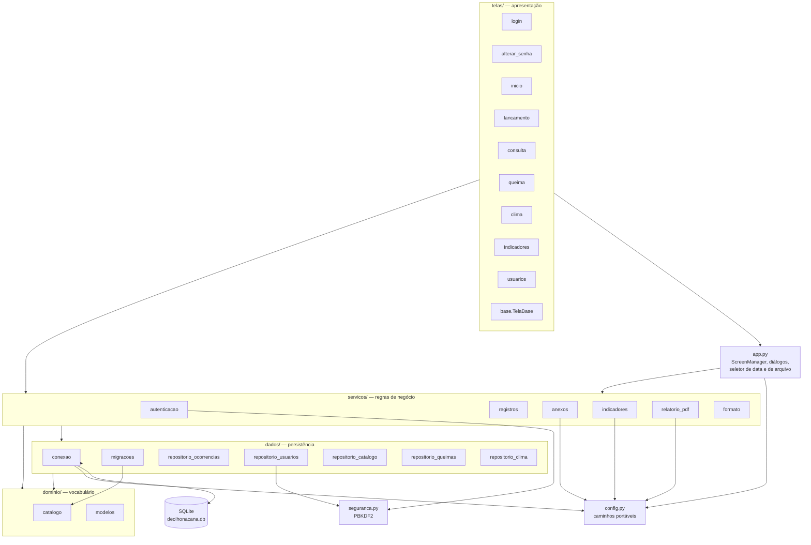
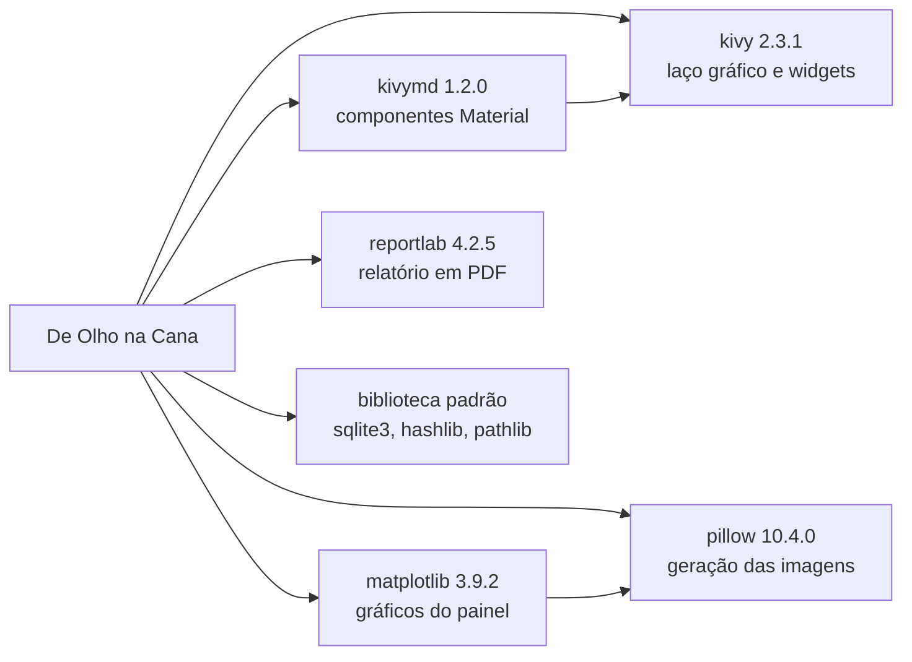

# Camadas e dependências

## Visão geral

A dependência aponta sempre para baixo. Nenhum módulo de uma camada inferior importa algo
de uma camada superior — é o que permite testar toda a regra de negócio sem instanciar o
Kivy.

## Regra de dependência

| Camada | Pode importar | Não pode importar |
|---|---|---|
| `telas/` | `servicos/`, `config`, o próprio `app` | `dados/` diretamente |
| `servicos/` | `dados/`, `dominio/`, `config`, `seguranca` | `telas/`, `kivy` |
| `dados/` | `dominio/`, `config`, `seguranca` | `servicos/`, `telas/`, `kivy` |
| `dominio/` | nada do projeto | qualquer outra camada |

A única exceção deliberada é `telas/consulta.py`, que importa
`repositorio_ocorrencias` para ler a lista de ordenações disponíveis e para recarregar a
tabela — uma leitura sem regra de negócio associada.

## Dependências externas

Cinco dependências, todas instaláveis offline a partir de um cache do pip. Não há cliente
HTTP, driver de navegador nem biblioteca de nuvem — coerente com o requisito de operação
sem rede.

O projeto anterior dependia ainda de `selenium`, `pandas` e `openpyxl`, além de um
`chromedriver.exe` de 19 MB. As três saíram: o Selenium com o dashboard remoto, o pandas e
o openpyxl quando as duas planilhas de apoio viraram tabelas do banco.
