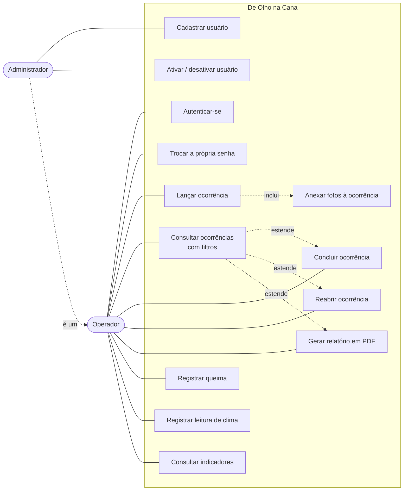

# Casos de uso

## Atores

- **Operador** — registra apontamentos de campo, boletins de queima e leituras de clima,
  consulta e conclui ocorrências.
- **Administrador** — tudo que o operador faz, mais o cadastro e a desativação de contas.

## Detalhamento dos casos principais

### UC01 — Autenticar-se

**Ator:** operador ou administrador.
**Pré-condição:** conta cadastrada e ativa.

1. O usuário informa login e senha.
2. O sistema confere a senha contra o hash PBKDF2 armazenado.
3. Se for o primeiro acesso, desvia para a troca obrigatória de senha (UC02).
4. Caso contrário, abre a sessão e exibe o menu principal.

**Fluxos alternativos**
- Senha incorreta ou usuário inexistente: mesma mensagem genérica, para não revelar quais
  logins existem.
- Cinco tentativas erradas seguidas: o login fica bloqueado por 60 segundos.
- Conta desativada: acesso negado com mensagem própria.

### UC03 — Lançar ocorrência

**Ator:** operador.
**Pré-condição:** estar autenticado.

1. O usuário informa a data (padrão: hoje).
2. Escolhe a gleba; o sistema preenche fazenda, município e administrador.
3. Informa a quadra.
4. Escolhe a categoria e, dentro dela, o serviço.
5. Descreve a observação e, opcionalmente, indica um responsável.
6. Anexa até três fotos (UC04).
7. Confirma; o sistema valida, copia as fotos e grava numa única transação.

**Fluxos alternativos**
- Campo obrigatório vazio, data no futuro ou categoria não escolhida: o sistema recusa com
  a mensagem correspondente e nada é gravado.
- Arquivo anexado que não é imagem ou passa de 15 MB: recusado antes de gravar.

### UC06 — Concluir ocorrência

**Ator:** operador.
**Pré-condição:** existir ocorrência pendente.

1. O usuário localiza a ocorrência pelos filtros da consulta.
2. Seleciona a linha na tabela.
3. Aciona "Concluir ocorrência" e informa o responsável.
4. O sistema grava a data de conclusão e muda o status para Finalizado.

**Fluxos alternativos**
- Ocorrência já finalizada: recusada com aviso.
- Data de conclusão anterior à de abertura: recusada pela regra e também pelo banco.

### UC08 — Gerar relatório em PDF

**Ator:** operador.

1. O usuário aplica os filtros desejados na consulta.
2. Aciona "Gerar PDF".
3. O sistema monta o relatório com o recorte visível e as fotos anexadas, grava em
   `Documentos/De Olho na Cana` e abre no leitor padrão.

**Fluxo alternativo**
- Filtro sem resultado: o sistema avisa e não gera arquivo.
