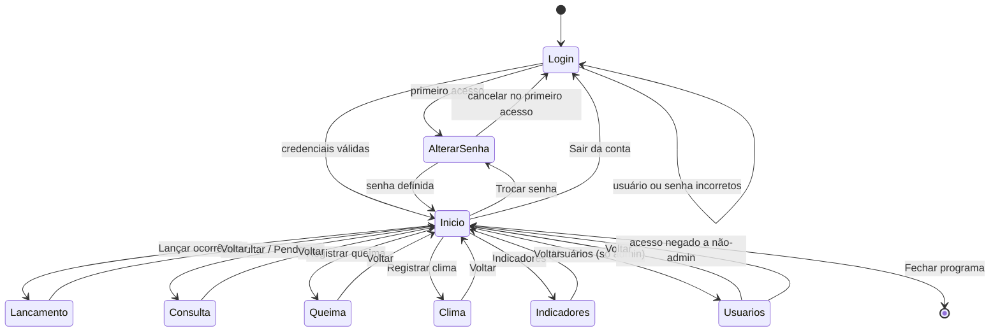
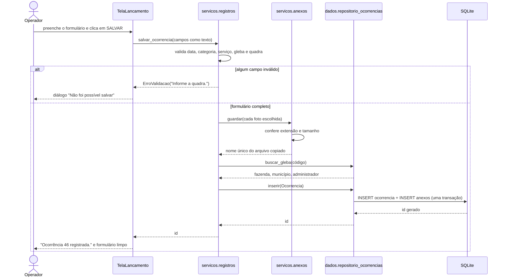
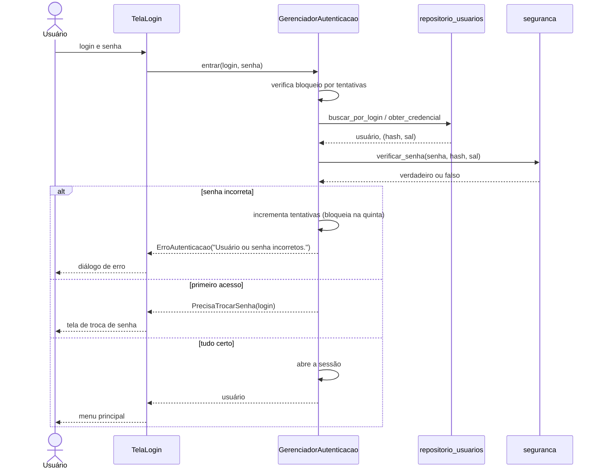

# Fluxo de telas

Nove telas, gerenciadas por um `ScreenManager`. O menu principal é o centro: toda tela de
trabalho volta para ele.

## Sequência de um lançamento

Mostra a separação entre as camadas: a tela nunca fala com o banco.

## Sequência do login

