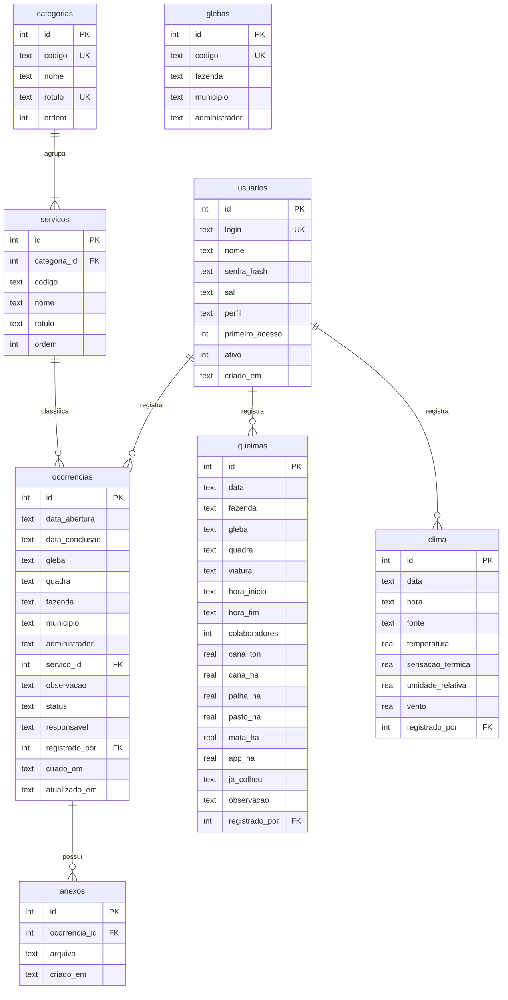

# Modelo de dados

Banco SQLite único, criado na primeira execução a partir de
[`deolhonacana/dados/esquema.sql`](../deolhonacana/dados/esquema.sql).

## Diagrama entidade-relacionamento



## Tabelas

### `usuarios`

Quem opera o sistema. A senha nunca é gravada: guardam-se `senha_hash` e `sal`, saída de
PBKDF2-HMAC-SHA256 com 240 mil iterações.

- `login` é `UNIQUE COLLATE NOCASE` — `Maria` e `maria` são a mesma pessoa.
- `perfil` aceita `admin` ou `operador`; só o admin abre a tela de usuários.
- `primeiro_acesso = 1` desvia o login para a troca de senha.
- `ativo = 0` bloqueia o acesso sem apagar o histórico de quem já registrou ocorrências.

### `categorias` e `servicos`

Vocabulário controlado dos apontamentos: 27 categorias e 134 serviços, semeados a partir
de `dominio/catalogo.py`. Guardar `codigo` (`4`, `4.1`) separado de `nome` permite ordenar
numericamente e filtrar por prefixo; `rotulo` guarda o texto como aparece na tela.

A semeadura usa `ON CONFLICT ... DO UPDATE`, então acrescentar um serviço ao catálogo e
reabrir o programa atualiza o banco sem duplicar nada.

### `glebas`

Substitui o arquivo `Espelho_banco_Glebas.xlsx`. Ao escolher a gleba no lançamento, a
fazenda, o município e o administrador são preenchidos a partir daqui — o operador não os
digita, o que elimina a mesma gleba aparecer com grafias diferentes de fazenda.

### `ocorrencias`

O apontamento de campo. Duas restrições `CHECK` garantem coerência independentemente da
interface:

```sql
CHECK ((status = 'Finalizado' AND data_conclusao IS NOT NULL)
    OR (status = 'Pendente'   AND data_conclusao IS NULL))

CHECK (data_conclusao IS NULL OR data_conclusao >= data_abertura)
```

`fazenda`, `municipio` e `administrador` são copiados da gleba no momento do registro, de
propósito: se a gleba for depois transferida de administrador, o histórico preserva quem
respondia por ela na época.

Índices em `status`, `data_abertura` e `servico_id` atendem aos filtros da consulta.

### `anexos`

Um registro por foto. `arquivo` guarda **só o nome** dentro de `dados/anexos/`, nunca o
caminho absoluto de onde o usuário pegou a imagem. `ON DELETE CASCADE` remove os anexos
junto com a ocorrência.

### `queimas`

Boletim de combate a incêndio. As áreas são `REAL NOT NULL DEFAULT 0` com `CHECK >= 0`.
O **tempo de combate não é uma coluna**: é derivado de `hora_inicio` e `hora_fim` por
`calcular_tempo_combate()`, de modo que não há como divergir das horas informadas.
Combate que atravessa a meia-noite é tratado como no dia seguinte.

### `clima`

Leituras digitadas pelo operador. `UNIQUE (data, hora, fonte)` impede lançar duas vezes a
mesma leitura. `umidade_relativa` tem `CHECK BETWEEN 0 AND 100`.

### `vw_ocorrencias`

Visão que resolve a junção com categoria, serviço e usuário, e calcula:

```sql
CAST(julianday(COALESCE(o.data_conclusao, date('now','localtime')))
     - julianday(o.data_abertura) AS INTEGER) AS dias_pendentes
```

Toda consulta da aplicação lê desta visão, e não das tabelas cruas. Assim o cálculo existe
num lugar só.

## Formato das datas

| Onde | Formato | Motivo |
|---|---|---|
| Banco | `AAAA-MM-DD` | Único formato que o SQLite ordena, compara e subtrai corretamente |
| Tela e PDF | `dd/mm/aaaa` | O que o usuário brasileiro espera |

A tradução acontece só em `servicos/formato.py`. A versão anterior gravava `dd/mm/aaaa` no
banco e tentava fazer aritmética em cima disso, o que devolvia valores sem sentido.

## De onde veio cada tabela

| Tabela antiga | Virou |
|---|---|
| `Usuarios` (senha em texto puro) | `usuarios`, com hash e sal |
| `BANCO_DE_OLHO_NA_CANA` (16 colunas de texto) | `ocorrencias` + `categorias` + `servicos` + `anexos` |
| `BANCO_QUEIMAS` | `queimas`, com áreas numéricas e tempo derivado |
| `BANCO_CLIMA` (colunas como `"Temperatura(ºC)"`) | `clima`, com nomes sem acento nem parêntese |
| `Espelho_banco_Glebas.xlsx` | `glebas` |
| `Espelho_banco_Tipo_servico.xlsx` | `categorias` e `servicos` |

As duas planilhas deixaram de existir, e com elas a dependência do pandas e do openpyxl.
